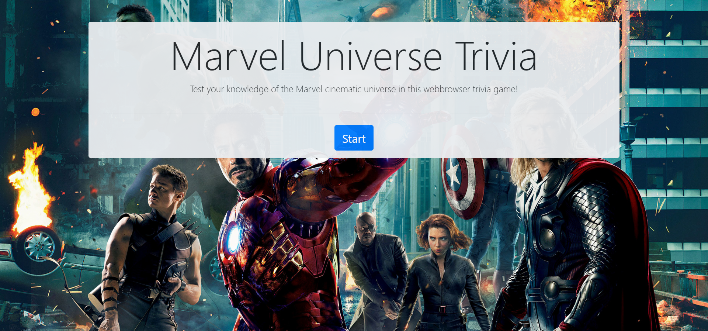

# TriviaGame

A simple timed webbrowser trivia game all about the Marvel universe. Users have ten seconds to answer each question and if time runs out the question counts as unanswered. Regardless if they answer the question correctly, incorrectly, or leave it unanswered a quick result screen shows them the correct answer, if they did not answer correctly, and a gif corresponding to the question. Once the quiz is over a result screen shows the user their score as well as a button to restart the game (without a page reload). The majority of styling is done through [Bootstrap](https://getbootstrap.com/) and its [grid system](https://getbootstrap.com/docs/4.3/layout/grid/).

# Link to Deployed Site
- [TriviaGame](https://jakedudum.github.io/TriviaGame/)

# Built With
- [HTML](https://developer.mozilla.org/en-US/docs/Learn/HTML)
- [CSS](https://developer.mozilla.org/en-US/docs/Web/CSS)
- [Bootstrap](https://getbootstrap.com/)
- [Javascript](https://developer.mozilla.org/en-US/docs/Web/JavaScript)
- [Jquery](https://jquery.com/)

# Versioning
- [Github](https://github.com/)

# Authors
### Jake Dudum